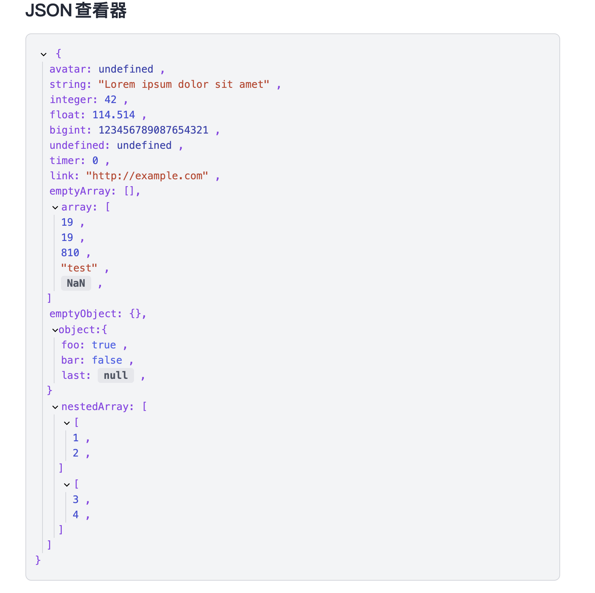

# 介绍 Introduction

这是一个基于 Svelte 的 JSON 查看器，支持 JSON 的格式化、展开、复制、搜索、排序等功能。

This is a JSON viewer based on Svelte, supporting JSON formatting, expansion, copying, searching, and sorting.



## 使用方式 How to use

```bash
# 安装依赖 install dependencies
pnpm install

# 启动开发环境 start development environment
pnpm run dev
```
